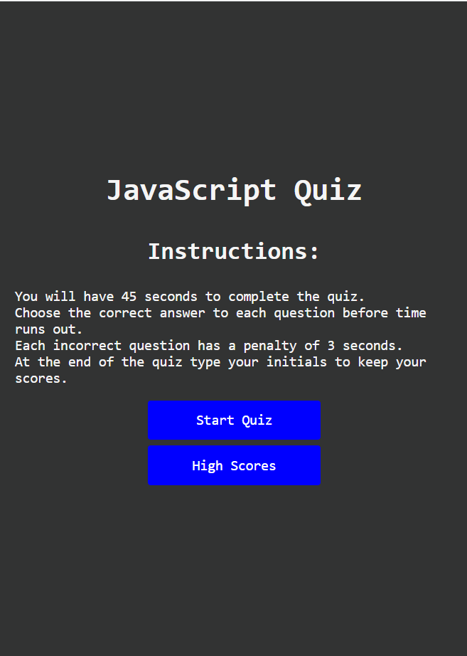
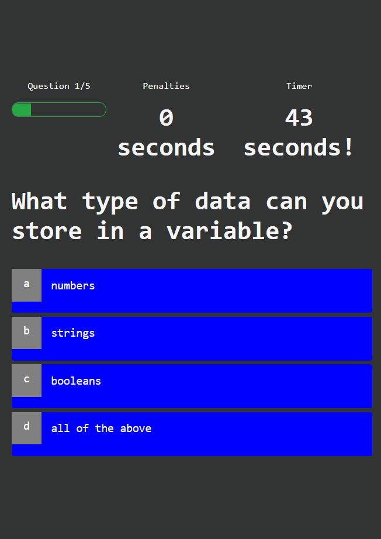
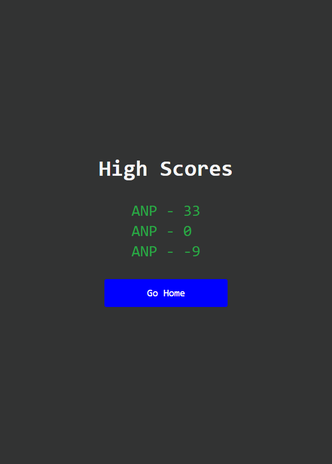
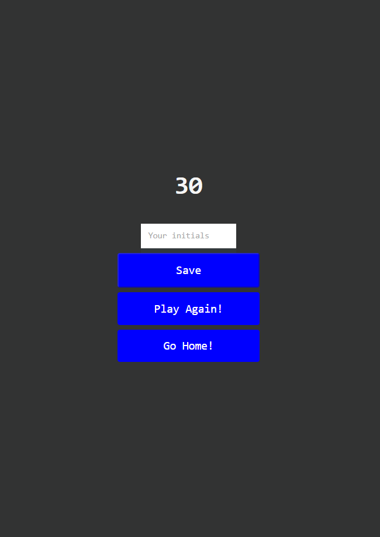

# quizAppJS

Content

This quiz application is coded with javaScript CSS and HTML.

The project consist on a timed quiz that gives the user penalties on the timer for each wrong question. 
At the end the user can save the score, which is the timer - penalties, with their initials.

[Link to website](https://00anp.github.io/quizAppJS/index.html)

